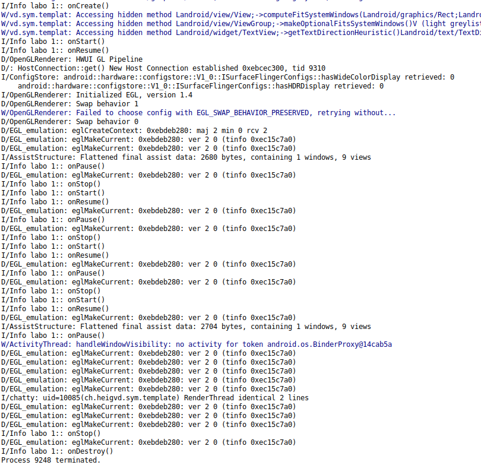

# Rapport SYM - Labo 1

##### Comment organiser les textes pour obtenir une application multi-langues (français, allemand, italien, langue par défaut : anglais) ? Que se passe-t-il si une traduction est manquante dans la 
langue par défaut ou dans une langue supplémentaire ?

Comment organiser les textes pour obtenir une application multi-langues (français, allemand,
italien, langue par défaut : anglais) ? 

Les strings des textes sont dans le fichier res/value/strings.xml. Ceci est le fichier de base mais l’on peut créer d’autre fichier res/nom-de-dossier/strings.xml par exemple : res/value-ja/strings.xml pour des textes en japonais

après il faut indiquer à l’application le langage à utiliser comme ceci :

String languageToLoad = "ja";
Locale locale = new Locale(languageToLoad);
Locale.setDefault(locale);
Configuration config = new Configuration();
config.locale = locale;
getResources().updateConfiguration(config,getResources().getDisplayMetrics());

Que se passe-t-il si une traduction est manquante dans la langue par défaut ou dans une langue supplémentaire ?

Si il manque un texte dans une langue supplémentaire, le texte de la langue par défaut et pris à la place.

Si il manque un texte dans la langue de base le compilateur retourne une erreur en disant qu’il manque une ressource.

##### Dans l’exemple fourni, sur le dialogue pop-up, nous affichons l’icône android.R.drawable.ic_dialog_alert, disponible dans le SDK Android mais qui n’est pas très bien adapté visuellement à notre utilisation. Nous souhaitons la remplacer avec notre propre icône, veuillez indiquer comment procéder. Dans quel(s) dossier(s) devons-nous ajouter cette image ? Décrivez brièvement la logique derrière la gestion des ressources de type « image » sur Android.

##### Info : Google met à disposition des icônes open source dans le style « Material Design » utilisé actuellement sur Android : https://material.io/resources/icons/

Pour pouvoir afficher/utiliser/modifier des images dans Android, on utilise la classe Drawable. Comme référencé dans la documentation Android, un Drawable est une abstraction général pour **quelque chose qu'on peut dessiné**.

Cette classe dispose de plusieurs sous-classes afin de pouvoir travailler avec notre image de la façon qu'on veut.

Il existe deux façon d'inclure une image dans un projet, on peut soit :

\- Ajouter un fichier **bitmap** dans le projet
\- Ajouter une propriété **XML** qui défini les différentes informations de l'image.

Les images étant facilement lourdes niveau mémoire, Android essaye de réduire leur taille en filtrant les couleurs par pixels, ou en effectuant d'autres modifications sur l'image afin de pouvoir réduire considérablement leur taille.

Lorsque l'on ajoute des images sur Android, celui-ci en créé plusieurs copies de ces mes en différentes tailles et en effectuant les différents filtres/modification comme vu avant et ainsi réduire la taille des données.

Les différentes images ajoutées par l'utilisateur sont référancée dans le dossier **res/drawable** avec un unique ID permettant de la retrouvée et de l'utiliser par la suite. Dans notre cas, nous avons ajouté une image appelée ic_icon_cat.png téléchargée sur google image afin de changer l'icon d'alerte en cas d'erreur sur le login, ce qui nous donne donc le code ci-dessous

```
alertbd.setIcon(R.drawable.ic_icon_cat);
```

##### Lorsque le login est réussi, vous êtes censé chaîner une autre Activity en utilisant un Intent. Si je presse le bouton "Back" de l'interface Android, que puis-je constater ? Comment faire pour que l'application se comporte de manière plus logique ? Veuillez discuter de la logique derrière les activités Android.

Lorsque l'on clique sur le bouton back nous revenons à la page de login. Le problème est que tous les champs du login précédents sont toujours remplis. Dans notre cas nous prefererions que la page de login soit clean car le back reviendrait à un logout.

Il faudrait donc vider les champs de la première activité pour que la page de login soit de nouveau à l'état initial. Il faudrait aussi terminer l'activité courante.

##### On pourrait imaginer une situation où cette seconde Activity fournit un résultat (par exemple l’IMEI ou une autre chaîne de caractères) que nous voudrions récupérer dans l'Activity de départ. Comment procéder ?

Il y a plusieurs solution. La première est d'utiliser un stockage persistant pour que toutes les activités y aient accès. Il est aussi possible d'indiquer à l'activité parente que celle qu'elle va créer renverra des données.

Pour le faire il faut indiquer à l'activité parente qu'un ou plusieurs résultats seront renvoyés par la nouvelle activité. Il faut utiliser la methode startActivityForResult(intent, request_code) pour l'indiquer.

Intent: Activité à lancer

Request_code: Code d'identification de l'activité

Une fois que cela est fait il faut renvoyer les résultats à l'activité parente depuis la nouvelle activité. Pour le faire il faut utiliser la méthode setResult().

Pour récupèrer les données renvoyées, il faut override la methode onActivityResult() dans l'activité parente. Cette méthode ressemble à ceci:

```java
@Overrideprotected void onActivityResult(int requestCode, int resultCode, Intent data) {    // Check which request we're responding to    
    if (requestCode == PICK_CONTACT_REQUEST) {        
        // Make sure the request was successful        
        if (resultCode == RESULT_OK) {            
            // The user picked a contact.            
            // The Intent's data Uri identifies which contact was selected.            
            // Do something with the contact here (bigger example below)        
        }    
    }
}
```

Cette méthode vérifiera quelle activité à renvoyé une donnée, puis vérifiera si le result code est équivalent ce qui permettera de savoir si l'activité aura bien réussi à envoyer les données vouluent. 

Une fois tout ceci verifié, on pourra utiliser les données.

Source: https://developer.android.com/training/basics/intents/result#java

##### Vous noterez que la méthode getDeviceId() du TelephonyManager, permettant d’obtenir l’IMEI du téléphone, est dépréciée depuis la version 26 de l’API. Veuillez discuter de ce que cela implique lors du développement et de présenter une façon d’en tenir compte avec un exemple de code.

Cette méthode est depreciée car elle renvoie soit l'imei dans le cas d'un gsm , le meid dans le cas d'un cdma ou null si il n'y en a aucun. Le problème est que il n'y a pas de différenciation entre l'imei et le meid. Et donc il n'est pas aisé de savoir ce que nous récupèrons.

Il y a de nouvelles méthodes pour avoir l'imei et le meid qui sont getImei() et getMeid(). Cela implique que lorsque l'on développe une application pour plusieurs API il faut faire du cas par cas suivant l'API. Par exemple:

```java
if (Build.VERSION.SDK_INT >= Build.VERSION_CODES.O) {
            String imei = telephonyMgr.getImei();
} else {
            String imei = telephonyMgr.getDeviceId();
}
```

Source : https://stackoverflow.com/a/46744134

##### Dans l’activité de login, en plaçant le téléphone (ou l’émulateur) en mode paysage (landscape), nous constatons que les 2 champs de saisie ainsi que le bouton s’étendent sur toute la largeur de l’écran. Veuillez réaliser un layout spécifique au mode paysage qui permet un affichage mieux adapté et indiquer comment faire pour qu’il soit utilisé automatiquement à l’exécution.

Il y a plusieurs dossiers qui déffinissent les layouts:

`layout`: general layouts

`layout-port`: layout for widget that must change for portrait orientation

`layout-land`: layout for widget that must change for landscape orientation

Il faut donc créer un layout qui a le même nom que celui général dans le dossier payout-land. Ensuite il faut faire les modifications que l'on veut dans le nouveau layout. 

Grâce à ça il sera automatiquement utilisé en landscape.

##### Implémentez dans votre code les méthodes onCreate(), onStart(), onResume(), onPause(), onStop(), etc... qui marquent le cycle de vie d'une application Android, et tracez leur exécution dans le logcat. Décrivez brièvement à quelles occasions ces méthodes sont invoquées. Vous expliquerez aussi l’enchainement de ces appels lorsque l’on passe d’une activité à l’autre. Comment pouvez-vous factoriser votre code pour éviter de devoir réimplémenter ces méthodes dans chacune de vos activités ?

Décrivez brièvement à quelles occasions ces méthodes sont
invoquées.

OnCreate : Quand l’activité est créée

onStart : Elle est appellée quand une application devient l’activité principale

onPause : Quand l’application est mise en pause (si l’utilisateur appuie sur home par exemple)

onStop : Quand l’application est en attente (qu’elle n’est pas la principale)

onResume : Quand l’utilisateur revient sur l’activité

onDestroy : Quand l’application est arretée.

Vous expliquerez aussi l’enchainement de ces appels lorsque l’on passe d’une
activité à l’autre.

D’abort l’appel à la fonction onCreate est réalisé quand on ouvre une application. Puis la méthode onStart  et onResume sont appelées directement après. Si l’on appuie sur home la méthode onPause est appelée, puis directement onStop (comme l’application est en attente). Si l’on redonne la main à l’application, la méthode onStart est appelée, puis la méthode onResume .
Quand l’on passe d’une activité à une autre (par exemple quand l’on à passer la page de login) l’activité appelle la méthode onStop.
Si l’on ferme l’application, la méthode onDestroy est appelée.

Comment pouvez-vous factoriser votre code pour éviter de devoir réimplémenter ces méthodes dans chacune de vos activités ?

Il faut déclarer une sous-classe de la classe AppCompatActivity qui réimplémente les méthodes voulue, puis l’on utilise cette classe pour générer nos activités. Comme ceci les méthodes seront déjà surchargées.

Voici le screen de nos logs:

